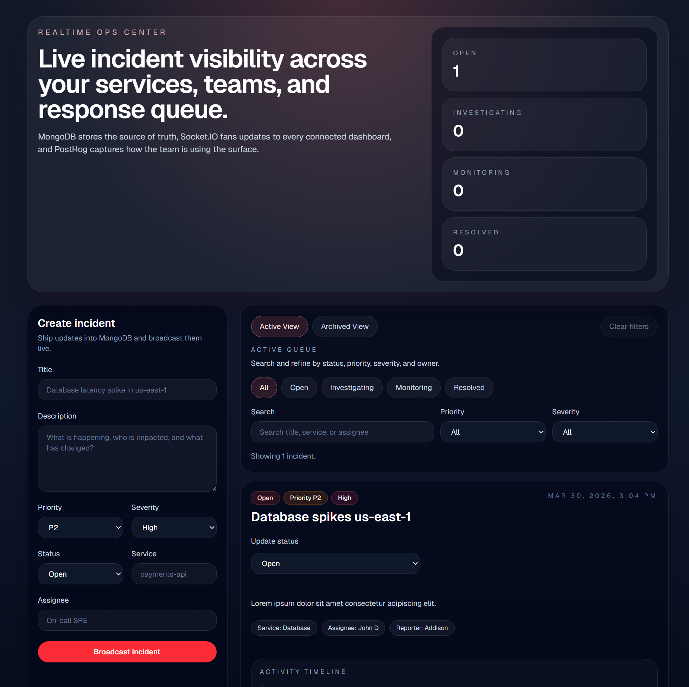
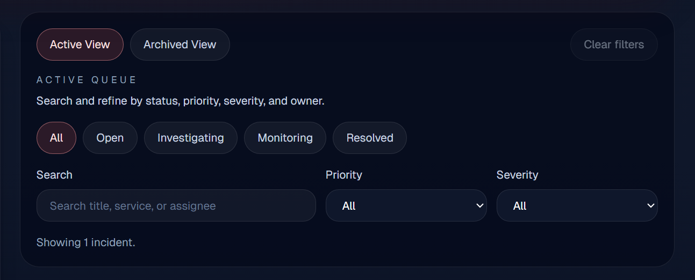
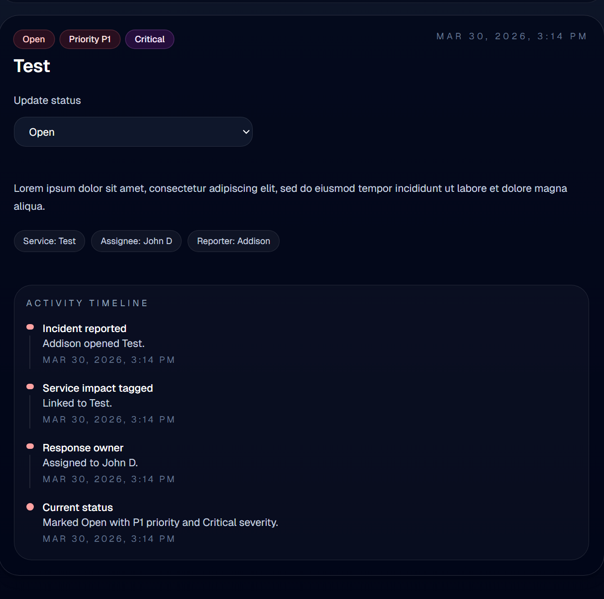

## Real-Time Incident Dashboard

A full-stack incident management dashboard built with Next.js, MongoDB, and Socket.IO, featuring real-time updates, advanced filtering, search, and workflow management.

## 🚀 Live Demo
[View Live App](https://incident-dashboard-7jtt.onrender.com/)


## ⚡ Features
-  Real-time incident updates with Socket.IO
-  Advanced filtering (status, priority, severity)
-  Search by title, service, and assignee
-  Incident workflow management (status updates)
-  Archive system for resolved incidents
-  Live dashboard metrics
-  Clean, modern UI with smooth interactions

## 🛠 Tech Stack

- Next.js
- TypeScript
- MongoDB (Mongoose)
- Socket.IO
- Tailwind CSS
- PostHog (analytics-ready)


## 📸 Screenshots

### Real-time incident dashboard


### Advanced filtering and search


### Status updates and workflow management


## Getting Started

1. Clone the repo
2. Install dependencies

```bash
npm install


